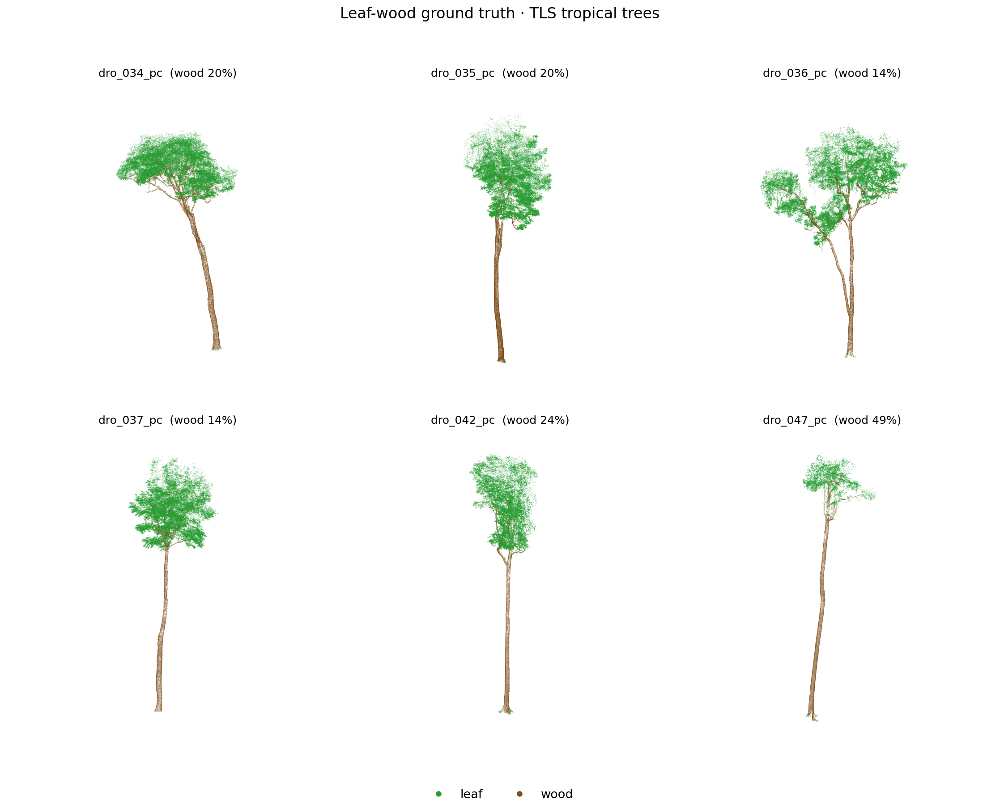
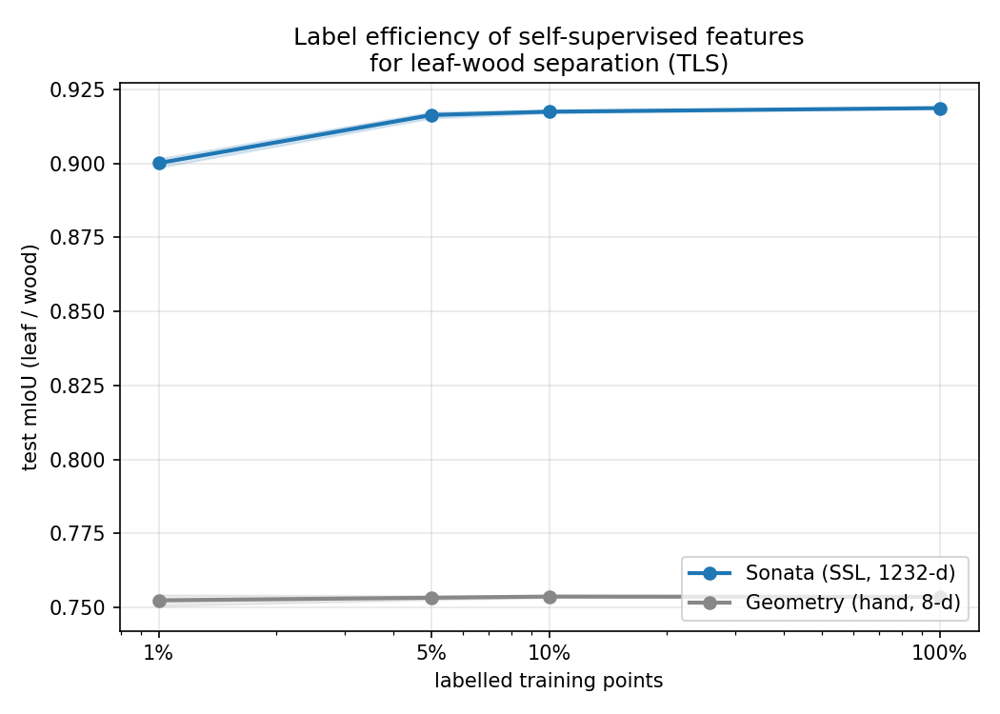
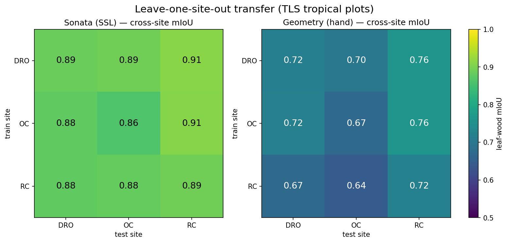
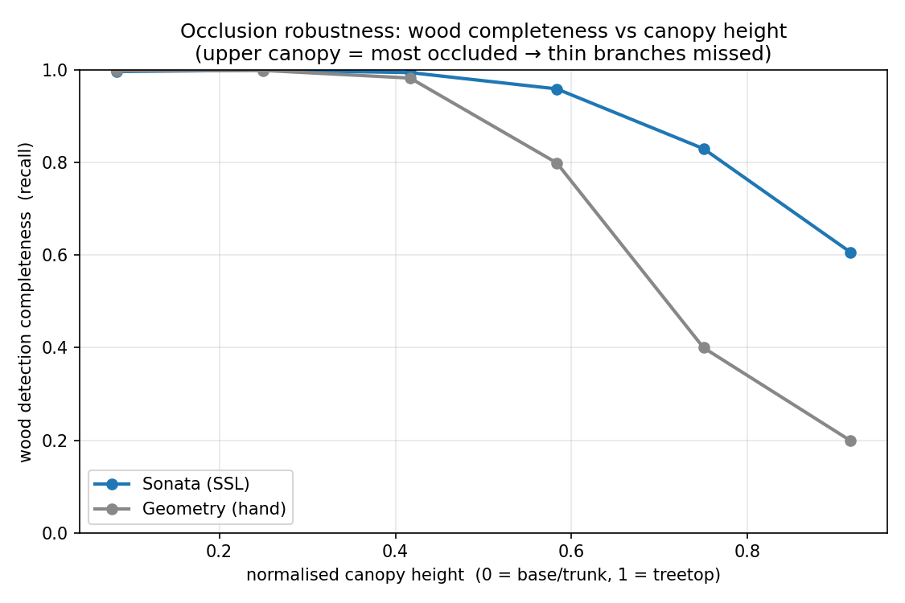
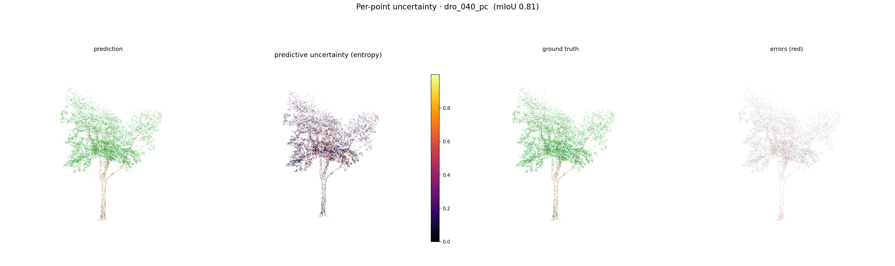

# forest-leafwood-seg

**Label-Efficient Leaf-Wood Separation in TLS Forest Point Clouds**

Self-supervised pre-training (Sonata / Point Transformer V3) + geometric weak labels for
leaf-wood separation in terrestrial laser scanning (TLS) forest point clouds. The goal is to
reach near-fully-supervised accuracy with only a small fraction of labels, generalise across
sites (leave-one-site-out), and quantify per-point uncertainty and occlusion-stratified
accuracy — directly targeting the most-cited unsolved problem in TLS biomass: leaf-wood
separation under canopy occlusion.

## Key results

Frozen self-supervised features (Sonata, a Point Transformer V3 backbone) + a single linear
classifier, evaluated on manually leaf/wood-annotated tropical-tree TLS (148 trees, 3 sites).

| Result | Self-supervised (Sonata) | Hand-crafted geometry |
|---|---|---|
| Test mIoU @ **1% labels** | **0.900** | 0.752 |
| Test mIoU @ 100% labels | 0.919 | 0.754 |
| Cross-site transfer (LOCO, off-diagonal mIoU) | **0.892** | 0.710 |
| Wood completeness in occluded upper canopy | **0.61** | 0.20 |

- **Label efficiency** — 1% of labelled points already reaches 0.90 mIoU; +15 mIoU over a
  hand-crafted geometric-feature baseline under an identical linear classifier.
- **Cross-site generalisation** — train on one plot, test on another with almost no drop.
- **Uncertainty** — predictive entropy concentrates at leaf-wood boundaries and in the
  occluded crown (error points carry ~3.5× the entropy of correct points).
- **Occlusion robustness** — wood detection completeness degrades with canopy height for both
  methods, but the self-supervised representation degrades far less.

## Figures

| | |
|---|---|
|  |  |
| Manually annotated leaf-wood ground truth | Label-efficiency curve |
|  |  |
| Leave-one-site-out transfer matrix | Occlusion robustness vs canopy height |


*Per-point predictive uncertainty: prediction · entropy · ground truth · errors.*

## Method

```
Sonata (self-supervised Point Transformer V3) — frozen encoder
   └─ per-point features (1232-d)
        └─ linear classifier → leaf / wood
Baseline: same linear classifier on 8-d hand-crafted covariance features (no pretraining)
Evaluation blocks:
   [B1] label-efficiency curve (1 / 5 / 10 / 100% labels)
   [B2] leave-one-site-out cross-site transfer matrix
   [B3] per-point predictive uncertainty (ensemble of linear heads, entropy)
   [B6] occlusion-stratified wood completeness vs canopy height
```

## Data

- **Labelled benchmark** — 148 manually leaf/wood-annotated tropical-tree TLS point clouds
  (RIEGL VZ-400, NE Australia; 3 plots), CC-BY 4.0.
- **Pre-training corpus (optional scale-up)** — FOR-species20K individual-tree laser scans.

Geometric weak labels (covariance linearity / verticality → wood vs leaf pseudo-labels) are
included as a zero-label reference; they are deliberately noisy and motivate the
label-efficient learning approach.

## Stack

PyTorch · Sonata / Point Transformer V3 · jakteristics · Open3D · laspy. Single RTX-class GPU
(24 GB) is sufficient: feature extraction peaks at ~10.5 GB; the linear classifier trains in
seconds.

## Repository

```
src/    feature extraction, label-efficiency, LOCO, uncertainty, occlusion, weak labels, rendering
figs/   signature figures
docs/   technical plan, motivation
web/    React project site (deployable to GitHub Pages)
```

## Author

Guanxiong Huang — Northwest A&F University · [harry.huang@nwafu.edu.cn](mailto:harry.huang@nwafu.edu.cn)

Live demo: https://harry33t.github.io/forest-leafwood-seg/

## License

Code: TBD. Sonata pre-trained weights are CC-BY-NC 4.0 (research use).
